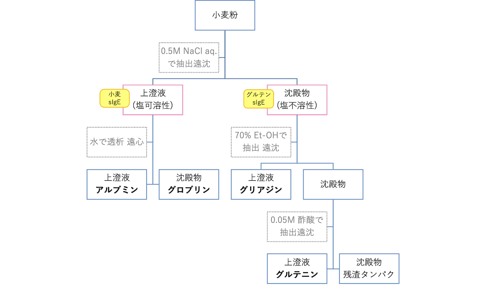

---
categories:
- medicine
- 食物アレルギー
- 抗原別
date: 2022-03-08 12:00:00 +0900
tags:
- medicine
- 食物アレルギー
- 抗原別
- private-memo
- AYOR
title: 小麦
type: page
---

## 小麦 (Wheat)

### 概要

- 小麦(Wheat; *Triticum aestivum*)の種子
- 薄力粉[^1]として
  - エネルギー: 367kcal / 100g
  - タンパク質: 7.3g / 100g
- 中力粉[^1]として
  - エネルギー: 367kcal / 100g
  - タンパク質: 9.0g / 100g
- 強力粉[^1]として
  - エネルギー: 365kcal / 100g
  - タンパク質: 11,8g / 100g
- 加工品
  - 粉 100 : 水 45でうどん生地となる
  - ゆでうどん
    - エネルギー: 105 kcal / 100g
    - タンパク質: 2.6g / 100g
    - 1玉は200-280g程度
    - 長さを測ってみたところ0.25g/cmだった
  - うどん乾麺
    - エネルギー: 348 kcal / 100g
    - タンパク質: 8.5g / 100g
  - そうめん(ゆで)
    - エネルギー: 127 kcal / 100g
    - タンパク質: 3.5g / 100g (うどんより濃い)
  - 生パスタ
    - エネルギー: 246 kcal / 100g
    - タンパク質: 7.8g / 100g
  - パスタ(ゆで)
    - エネルギー: 165 kcal / 100g
    - タンパク質: 5.4g / 100g
  - 食パン
    - エネルギー: 260 kcal / 100g
    - タンパク質: 9.0g / 100g
    - 1斤は最低でも340gと決まっている
      - 超熟だと1斤 = 370g, 6枚切りで60g程度(タンパク質 4900mg)
      - パン 1枚 = 体積にして 240mL 程度
      - パン 1cm³ = うどん 0.83g相当

#### 相模原病院のSTEP

{: .scope-kcrt}

```
-   STEP 0 (ゆでうどん 2g) = 小麦タンパク質 52mg
-   STEP 1 (ゆでうどん 15g) = 小麦タンパク質 390mg
-   STEP 2 (ゆでうどん 50g) = 小麦タンパク質 1300mg
-   STEP 3 (ゆでうどん 200g) = 小麦タンパク質 5200mg
```

### コンポーネント

#### 分画



|名称|分画|割合|コメント|
|:----|:----|:----|:----|
|アルブミン|水溶性|15%| |
|グロブリン|中性塩類溶液に可溶|3%| |
|プロラミン|含水アルコール・酸・アルカリに可溶|33%|グリアジンなど|
|グルテ**リ**ン|酸・アルカリに可溶|45%|グルテニンなど|
|その他|溶けない|-| |

- グリアジンはα, β, γ, ω(ω1, ω2, ω5)の４タイプに分類される。
- グルテニンは低分子量(LMW)・高分子量(HMW)に分けられる。
- グルテン = グリアジン + グルテニン

#### コンポーネント

- [IUIS](http://www.allergen.org/search.php?allergenname=&allergensource=Triticum+aestivum)

|Allergen|Biochemical name|MW (SDS-Page); kDa|コメント|
|:----|:----|:----|:----|
|Tri a 14|Non-specific lipid transfer protein 1|9| |
|Tri a 15|Monomeric alpha-amylase inhibitor 0.28| | |
|Tri a 18|Agglutinin isolectin 1| | |
|Tri a 19|Omega-5 gliadin, seed storage protein|65| |
|Tri a 20|Gamma gliadin|35 to 38 kDa| |
|Tri a 21|Alpha-beta-gliadin| | |
|Tri a 25|Thioredoxin| | |
|Tri a 26|High molecular weight glutenin|88| |
|Tri a 27|Thiol reductase homologue|27| |
|Tri a 28|Dimeric alpha-amylase inhibitor 0.19|13| |
|Tri a 29|Tetrameric alpha-amylase inhibitor CM1/CM2|13| |
|Tri a 30|Tetrameric alpha-amylase inhibitor CM3|16| |
|Tri a 31|Triosephosphate-isomerase| | |
|Tri a 32|1-cys-peroxiredoxin| | |
|Tri a 33|Serpin| | |
|Tri a 34|Glyceraldehyde-3-phosphate-dehydrogenase| | |
|Tri a 35|Dehydrin| | |
|Tri a 36|Low molecular weight glutenin GluB3-23|40 kDa| |
|Tri a 37|Alpha purothionin|12 kDa| |
|Tri a 39|Serine protease inhibitor-like protein| | |
|Tri a 40|Chloroform/methanol-soluble (CM) 17 protein [alpha amylase inhibitor]|15.96 kDa| |
|Tri a 41|Mitochondrial ubiquitin ligase activator of NFKB 1| | |
|Tri a 42|Hypothetical protein from cDNA| | |
|Tri a 43|Hypothetical protein from cDNA| | |
|Tri a 44|Endosperm transfer cell specific PR60 precursor| | |
|Tri a 45|Elongation factor 1 (EIF1)| | |

### その他の麦類

- ライ麦にはグルテニンが含まれていない。

[^1]: <https://fooddb.mext.go.jp/>
